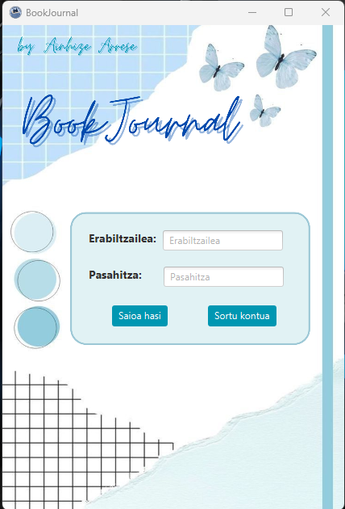
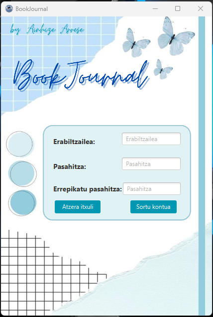
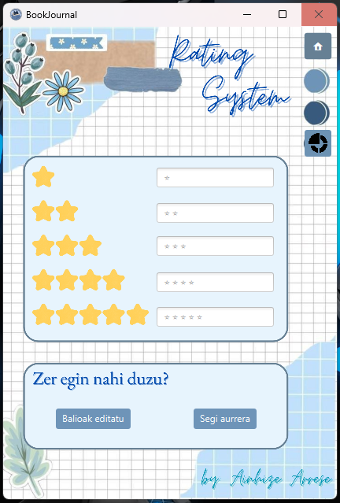
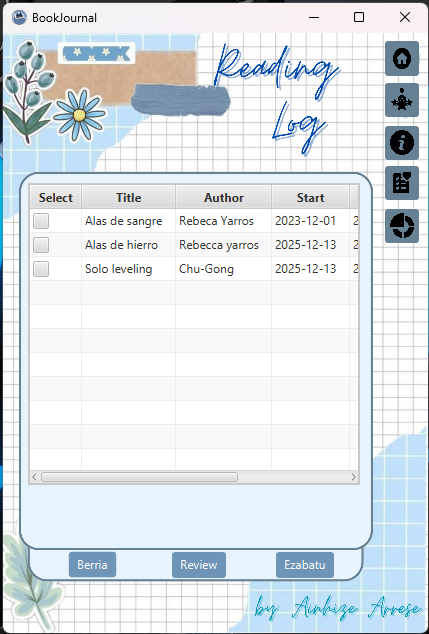
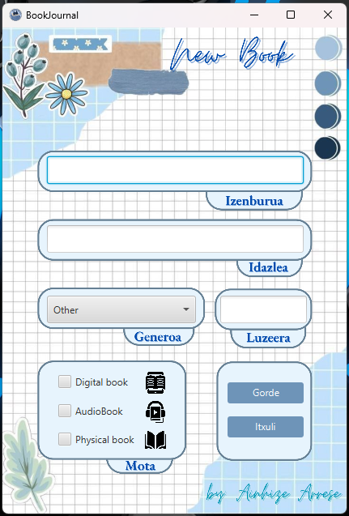
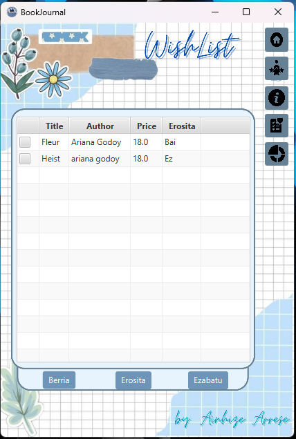
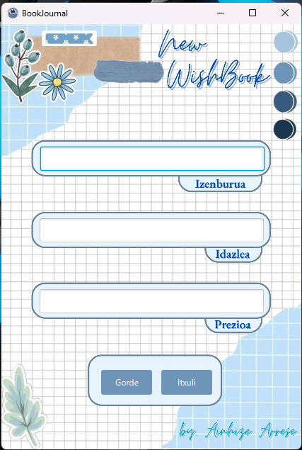
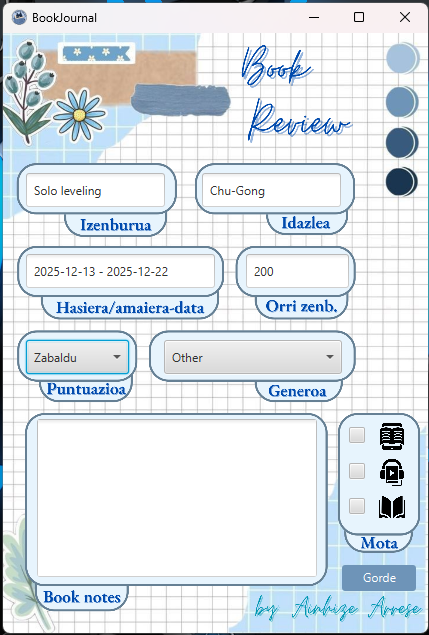
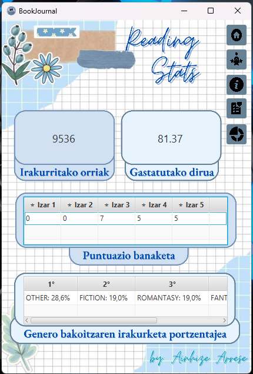
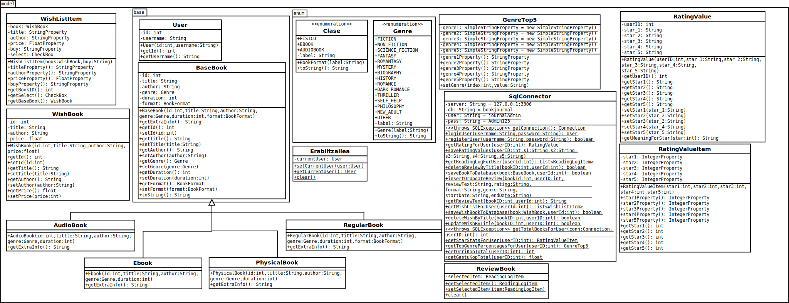

# 📚 BookJournal - Aplication
### 👩‍💻 AUTHOR

- [Ainhize Arrese](https://github.com/arreseAinhize)

##
## 🔎 TABLE OF CONTENTS

- [1.- INTRODUCTION](#1--introduction)
  - [1.1.- Technologies Used](#11--technologies-used)
- [2.- GRAPHICAL INTERFACE FLOW](#2--graphical-interface-flow)
  - [2.1.- Home Page](#21--home-page)
  - [2.2.- Rating System Page](#22--rating-system-page)
  - [2.3.- Reading Log Page](#23--reading-log-page)
  - [2.4.- Wishlist Page](#24--wishlist-page)
  - [2.5.- Book Review Page](#25--book-review-page)
  - [2.6.- Stats Page](#26--stats-page)
- [3.- CHANGES MADE](#3--changes-made)
- [4.- CLASS DIAGRAM](#4--class-diagram)
- [5.- ADDITIONAL INFORMATION](#5--additional-information)
  - [5.1.- Brief Description](#51--brief-description)
  - [5.2.- SQL Files](#52--sql-files)
- [6.- NOTES](#6--notes)
  - [6.1.- Weaknesses of the Work](#61--weaknesses-of-the-work)
  - [6.2.- Future Improvements](#62--future-improvements)

##
## **1.- INTRODUCTION**:

BookJournal is a digital diary created for users who read books. The goal is for each user to monitor and better understand their reading habits. The application stores user data, collects information about the books read, and displays statistics.

Through this application, users can better organize their reading experience, rate books, create wishlists, and have a visual overview of their reading habits.

### <ins>1.1.- TECHNOLOGIES USED</ins>:
- Java (following OOP principles)
- JavaFX (graphical interface)
- SceneBuilder (to create and manage .fxml files)
- CSS (to style the interface)
- XAMPP (database management)
- JDBC (communication between Java and the database)

## 
## **2.- GRAPHICAL INTERFACE FLOW**:
### <ins>2.1- Home Page</ins>

Log In:  
This section presents the application's login screen. Users must enter their "Username" and "Password" to access the application. These fields are located at the top of the screen, and below them appears the "Log In" button to verify the entered data. If the data is correct, the user is taken to the next section. Otherwise, the error message "Incorrect username or password." will be displayed, indicating that the credentials were entered incorrectly.

This happens if the ***handleLogin*** function, after searching the database with the entered data, receives a ***null*** value from the ***SqlConnector.loginUser(username, password)*** method; this means that no user was found with that password.

At the bottom of the screen, there is a "Remember" option, which allows the user to save their login data and log in automatically next time. In addition, a "Create account" button is also visible, allowing new users to register. This button executes the ***handleSignup*** function and takes the user to the registration screen.

There is also an option to close the application window in the upper right corner, so the user can exit whenever they want.

**POSSIBLE USERS:**
 - ***User:*** *drackon* / ***Pass:*** *Admin123*  
 - ***User:*** *uxutxu* / ***Pass:*** *Ridoc123*  

### <ins>2.2- Rating System Page</ins>
This section allows the user to manage book ratings. At the top of the screen, the title "Rating System" appears in a handwritten style, accompanied by colorful decorations (flowers, stickers, and blue colors).

In the center, five rating levels can be seen, divided by the number of stars (from 1 to 5 stars). Next to each level is a text box where the user can write the explanation or rating criteria corresponding to that number of stars. For example: ★, ★★, ★★★★★, etc.

At the bottom of the screen, the question "What do you want to do?" appears in a box, and two buttons are presented as answers:

Edit values: To change the text corresponding to the stars.

Continue: To proceed to the next section.

On the right side, navigation buttons can be seen again, including a home icon to return to the start.

### <ins>2.3- Reading Log Page</ins>
In this section, users can track their reading. At the top of the screen, the title "Reading Log" appears in a striking way, decorated with some elements (flowers, stickers, and pastel colors).

In the main area, a table is presented showing information about the books currently being read: columns named Select, Title, Author, and Start. In these columns, the user can see the book's title, author, and start date, as well as a selection box to choose items. For example, works by Rebeca Yarros and Chu-Gong appear in the list.

On the right side of the screen, several buttons with icons are visible: settings, help, and other function buttons. At the bottom, there are three buttons: New, Review, and Delete, to add new books, write reviews, and delete selected items, respectively.

The application is presented with a pleasant and organized visual style, allowing the user to easily organize their reading process.

### <ins>2.4- Wishlist Page</ins>
This section allows the user to manage their wishlist. At the top right of the screen, the title "WishList" appears in an italic and elegant font. The overall design uses a light style and blue tones, with a background reminiscent of graph paper. In the upper left and lower left corners, there are delicate decorative elements, such as flowers and leaves, giving a charming touch.

In the center, a list of books can be seen in table format. The columns are labeled "Title", "Author", "Price", and "Purchased". Currently, two books appear in the list: "Fleur" by Ariana Godoy with a price of 18.0 and "Yes" as the purchase status; and "Heist" also by Ariana Godoy with a price of 18.0 and "No" as the purchase status. At the beginning of each row, there is a checkbox, probably useful for selecting books.

At the bottom of the screen, there are three buttons: "New", "Purchased", and "Delete". These buttons seem to allow actions related to the books in the list.

### <ins>2.5- Book Review Page</ins>
This screen allows the user to create a review for a book. At the top right, the title "Book Review" appears in a beautiful and curved font. The background follows the style of previous screens, with blue tones reminiscent of graph paper and delicate decorative elements in the upper left and lower left corners.

In the center, there are several fields organized for entering review information. At the top, there are two text boxes labeled "Title" and "Author", in this case filled with the values "Solo leveling" and "Chu-Gong" respectively.

Below that, there is a field labeled "Start/end date" showing the range "2025-12-13 - 2025-12-22", and on the right another field labeled "Page num." showing the number "200".

Next, there are two dropdown lists: the left one "Expand" where the user's ratings appear, and the right one with "Other" selected and labeled "Genre".

At the bottom of the screen, there is a large text box labeled "Book notes" intended for writing review notes. On the right side, there is a section labeled "Type" with several checkboxes: representing physical book, audiobook, and e-book with icons.

At the bottom right of the screen, there is a "Save" button, presumably to save the entered information.

### <ins>2.6- Stats Page</ins>
In this section, general statistics about the user's reading are displayed in a visual and structured way. This screen is accessed through the application's internal navigation system, and its purpose is to provide the user with an overview of their reading habits.

**Data provided to the user:**
 - *Pages read:* Displayed in the upper left box. Shows the total number of pages the user has read (e.g., 9536).
 - *Money spent:* Displayed in the upper right box. Shows the total amount of money spent on reading activities in euros (e.g., 81.37).

**Rating distribution**
In the middle of the screen, a rating system appears, showing the number of books that have received each number of stars:

 - Distribution from 1 star to 5 stars.
 - For example, there are 7 books that received a 3-star rating.

**Percentage of reading by genre**
At the bottom, the distribution of books read by genre is displayed as a percentage. This table shows the weight of each genre in the total reading:

 - The top five main genres are shown (e.g.: OTHER, FICTION, ROMANTASY, FANTASY, THRILLER).
 - These percentages highlight which genres make up the main parts of the reading.

**Navigation and buttons**
On the right side of the screen, several buttons appear, allowing the user to quickly access other sections of the application. Each button has a distinctive icon and is linked to a specific function (e.g.: view statistics, user readings, home screen, etc.).

##
## **3.- CHANGES MADE**:
**Rating tracker section:**

**Favorite books section:**

##
## **4.- CLASS DIAGRAM**:

##
## **5.- ADDITIONAL INFORMATION**:

### <ins>5.1.- BRIEF DESCRIPTION</ins>:
#### **PURPOSE**
The BookJournal database was created for users to track the books they have read. Each user can manage their books, reviews, personalized ratings, and a "wishlist" of books they want.

#### **Database Structure**
1. Users: Stores the users.
 - *id*: Unique identifier for the user (PK).
 - *username*: Username (UNIQUE).
 - *password*: Password.

2. Book: Books read by each user.
 - *id*: Book identifier (PK).
 - *userID*: The user who read the book (FK).
 - *title, author, genre*: Information about the book.
 - *duration*: Number of pages or duration.
 - *format*: Physical, eBook, or Audiobook (ENUM).

3. WishList: List of books users want.
 - *id*: Item identifier (PK).
 - *userID*: Owner of the list (FK).
 - *title, author*: Information about the book.
 - *purchased*: Whether it has been purchased (Yes/No).
 - *price*: Price.

4. RatingValue: Each user's personalized rating system.
 - *userID*: User's ID (PK + FK).
 - *star_1 … star_5*: Personalized review descriptions for each star.

5. Review: Reviews given by users.
 - *id*: Review identifier (PK).
 - *bookID, userID*: Whose review and which book it is about (FK).
 - *reviewText*: Full text.
 - *rating, format, genre*: Summary of the rating and additional data.
 - *startDate, endDate*: Start and end dates of the reading.

#### **User**
The user is created so the application can work with the database:

`CREATE USER IF NOT EXISTS 'journalAdmin'@'%' IDENTIFIED BY 'Admin123';`

`GRANT INSERT, SELECT, UPDATE, DELETE ON bookjournal.* TO 'journalAdmin'@'%';`

### <ins>5.2.- SQL FILES</ins>:

- [SQL file](./bookjournal/src/main/resources/paagbat/sql/bookjournal.sql)

##
## **6.- NOTES**:

### <ins>6.1.- Weaknesses of the Work</ins>:
 - *Reliability of the data entry mechanism:* Users must manually enter data in several cases (date range, number of pages, etc.), which increases the possibility of errors. There is no automatic format validation in all cases.
 - *Interface adaptation to different sizes:* Changing the window size can cause some elements to be misplaced or information to be hidden. There is no fully responsive or adaptive design.
   
### <ins>6.2.- Future Improvements</ins>:
 - A main menu to improve application navigation, allowing access to different sections of the application.
 - Option to add book cover images: Allow users to add a cover image for the book, making the user experience more visual and personalized.
 - More advanced statistics: Add graphs over time (pages read per month, rating evolution, etc.) to better understand the user's reading habits.
 - Favorites list: Allow users to mark their favorite books and have a separate list for them.
