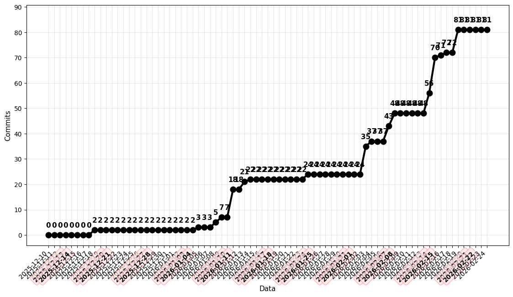
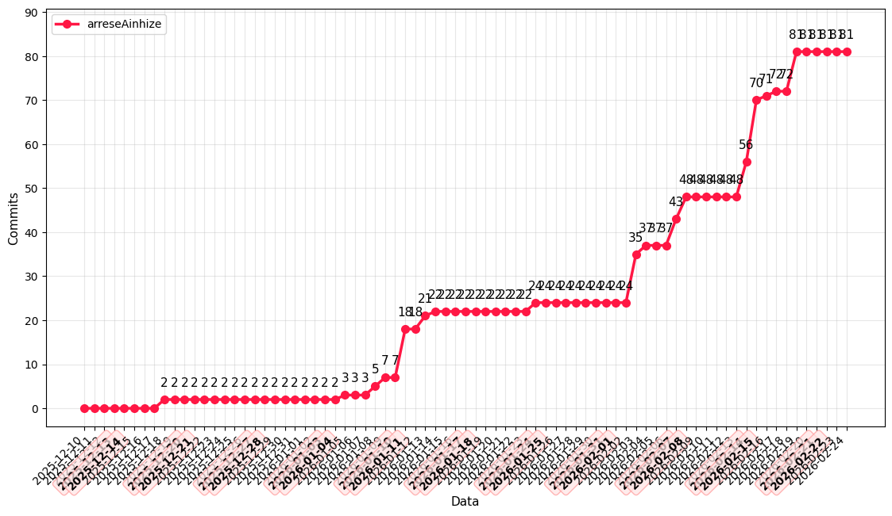
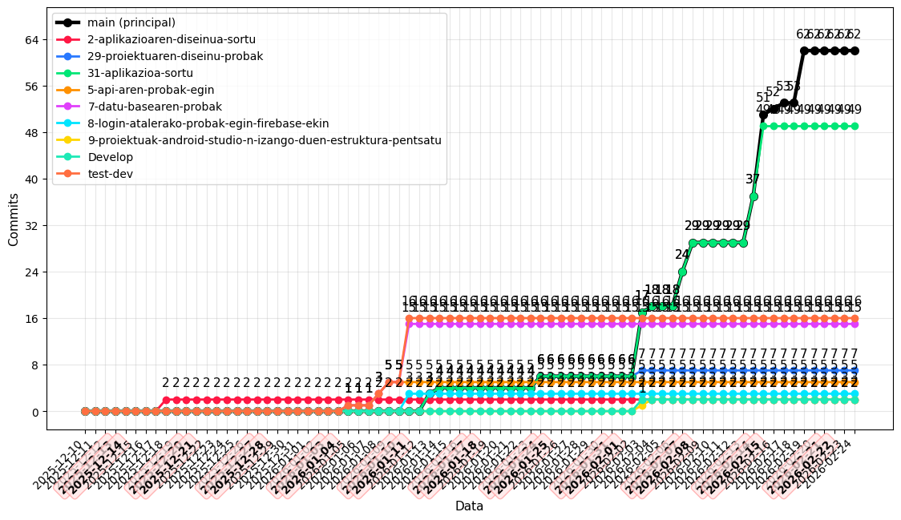
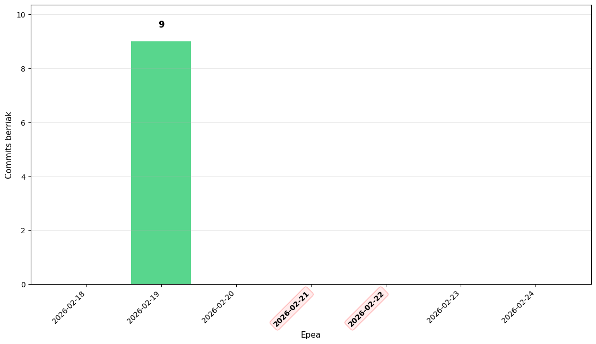
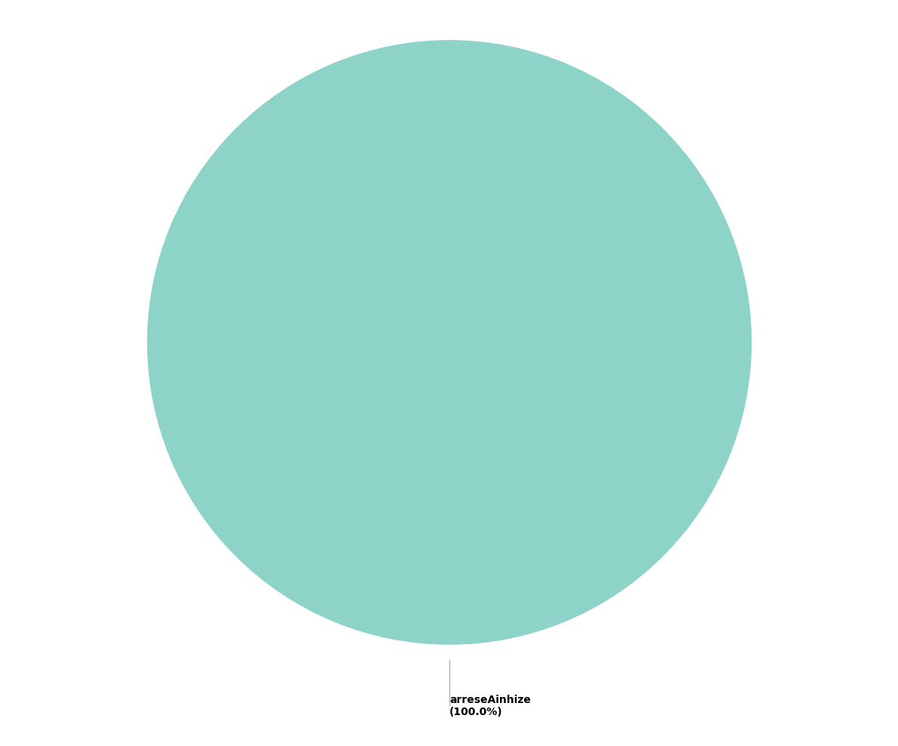
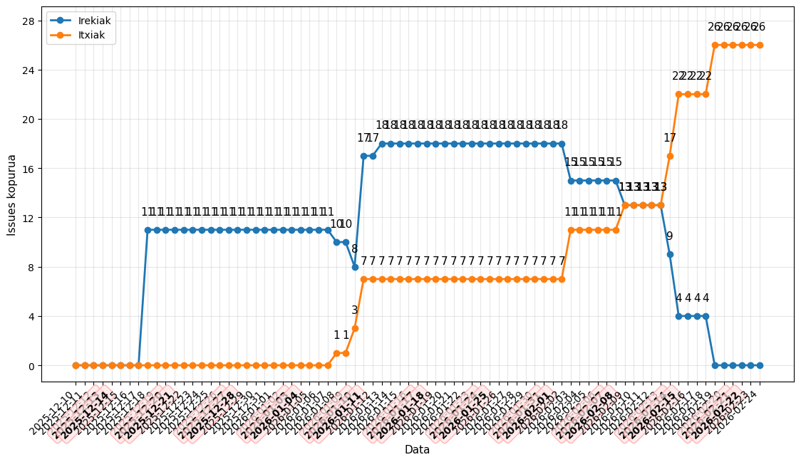

# Errepositorioaren estatistikak
Azken eguneraketa: 2026-02-24 08:10:14

<table>
<tr>
<td valign="top">

| Erabiltzailea | Commits-ak |
|--------------|---------|
| arreseAinhize | 81 |
| **Guztira** | **81** |

</td>
<td valign="top">

| Adarra | Commits-ak |
|--------|---------|
| 🌿 **main** | **62** |
| 2-aplikazioaren-diseinua-sortu | 2 |
| 29-proiektuaren-diseinu-probak | 7 |
| 31-aplikazioa-sortu | 49 |
| 5-api-aren-probak-egin | 5 |
| 7-datu-basearen-probak | 15 |
| 8-login-atalerako-probak-egin-firebase-ekin | 3 |
| 9-proiektuak-android-studio-n-izango-duen-estruktura-pentsatu | 2 |
| Develop | 2 |
| test-dev | 16 |

</td>
<td valign="top">

| 📊 Issues | Guztira |
|--------|---------|
| 📗 **Irekita** | 0 |
| 📕 **Itxita** | 26 |
| ➖➖➖ | ➖➖➖ |
| 🙋🏻 **Esleituta** | 26 |
| 👻 **Esleitu gabe** | 0 |
| ➖➖➖ | ➖➖➖ |
| 🏷️ **Etiketekin** | 26 |
| 🚫 **Etiketarik gabe** | 0 |

</td>
</tr>
</table>

## 👨‍🏫 Irakasleak / Profesores

- **@utamayo** (Urko)

## 📊 Estatistikaren bilakaera

### 1. Commits-ak Guztira

### 2. Erabiltzaileka Commits-ak

### 3. Adarka Commits-ak

### 4. Asteko Commits-en Jarduera

### 5. Erabiltzaileka Commits-en Banaketa

### 6. Issues (Irekita vs Itxita)

